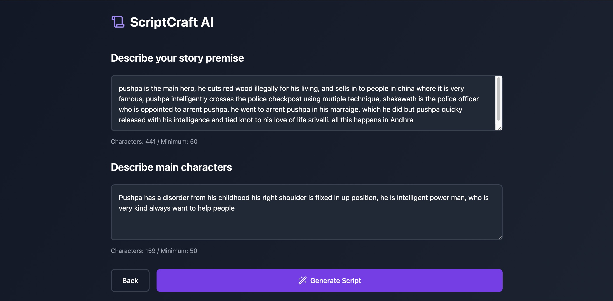
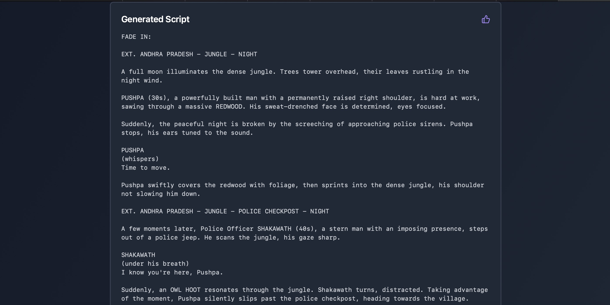
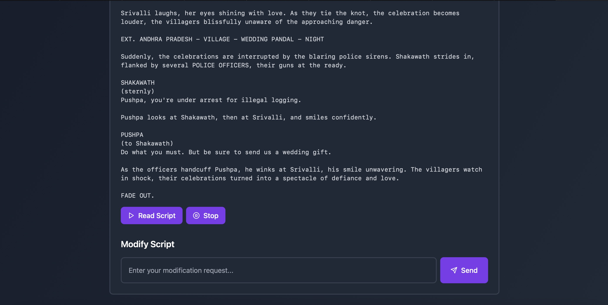

# Quick Setup and Installation

Follow these steps to set up and install the Vite + React project:

1. **Clone the repository:**
  ```sh
  git clone <repository-url>
  cd <repository-directory>
  ```

2. **Install dependencies:**
  ```sh
  npm install
  ```

3. **Add OpenAI API key to `.env` file:**
  Create a `.env` file in the root directory and add your OpenAI API key:
  ```sh
  VITE_OPENAI_API_KEY=your_openai_api_key
  ```

4. **Start the development server:**
  ```sh
  npm run dev
  ```


## Images



